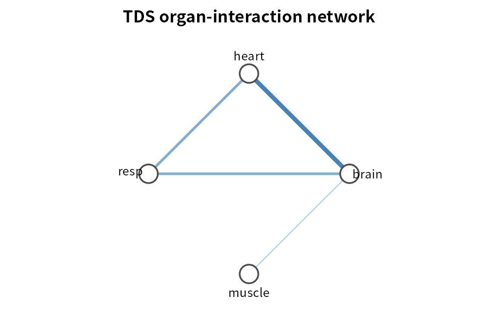
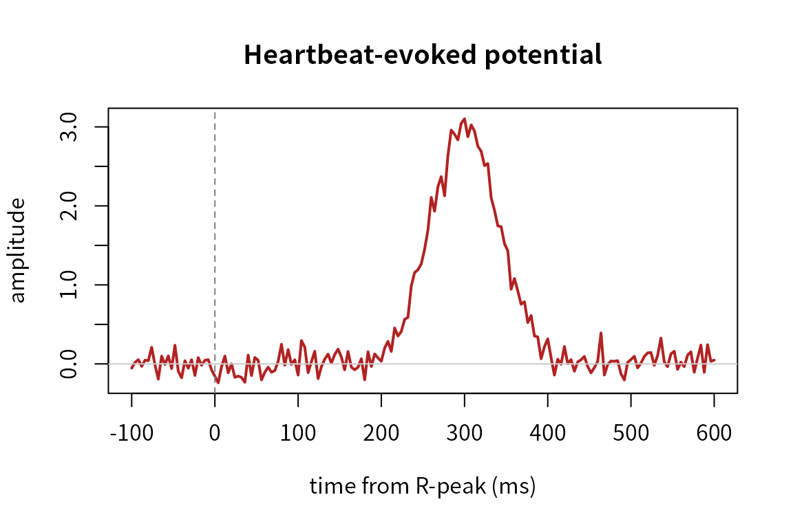

# Network Physiology with PhysioNetPhysiology

``` r

library(PhysioNetPhysiology)
#> PhysioNetPhysiology 0.1.0 - Time Delay Stability & organ-interaction networks
```

## What this package does

*Network Physiology* studies how distinct physiological systems — brain,
heart, respiration, muscle — **dynamically interact**. A single-modality
tool cannot ask that question; this package can, because it works over a
node matrix in which each column is one physiological system.

The engine is **Time Delay Stability (TDS)** (Bashan et al. 2012): slide
a window along the recording, and in each window find the lag that
maximises a pair’s cross-correlation. Where that lag stays put for a
stretch of time, the two systems are stably coupled. Stable couplings
become links in an *organ-interaction network*.

## A node matrix

Nodes are physiological features sampled on a common (usually slow)
grid. Here we simulate four systems where `brain` drives `heart` (a
fixed lag), and `heart` drives `resp` only during the second half of the
recording; `muscle` is independent.

``` r

n <- 4000; half <- n / 2
drive <- function() { s <- as.numeric(stats::filter(rnorm(n), rep(1/8, 8), sides = 2)); s[is.na(s)] <- 0; s }
brain  <- drive()
heart  <- c(rep(0, 4), brain[seq_len(n - 4)]) + rnorm(n, sd = 0.4)   # brain -> heart (lag 4)
resp   <- rnorm(n, sd = 0.4)
resp[(half + 4):n] <- heart[half:(n - 3)] + rnorm(half - 3, sd = 0.4) # heart -> resp, 2nd half
#> Warning in heart[half:(n - 3)] + rnorm(half - 3, sd = 0.4): longer object
#> length is not a multiple of shorter object length
#> Warning in resp[(half + 4):n] <- heart[half:(n - 3)] + rnorm(half - 3, sd =
#> 0.4): number of items to replace is not a multiple of replacement length
muscle <- rnorm(n)

X <- physioNodeMatrix(list(brain = brain, heart = heart,
                           resp = resp, muscle = muscle))
```

## Time Delay Stability

``` r

tds <- timeDelayStability(X, window = 200, step = 100, max_lag = 30, min_stable = 4)
summary(tds)
#>    from     to       tds stable_lag
#> 1 brain  heart 100.00000        4.0
#> 2 brain   resp  51.28205        8.0
#> 3 heart   resp  51.28205        4.0
#> 4 brain muscle  10.25641       17.5
#> 5 heart muscle   0.00000         NA
#> 6  resp muscle   0.00000         NA
```

`brain–heart` is stable across the whole recording; `heart–resp` and the
indirect `brain–resp` appear because respiration is coupled for half the
time.

## Organ-interaction network

Links are kept only if they clear a significance threshold estimated
from phase-randomised surrogates (which preserve each signal’s own
spectrum but destroy cross-signal timing).

``` r

net <- tdsNetwork(tds, surrogate = TRUE, X = X, n_surrogates = 30)
net
#> <TDS organ-interaction network>
#>   nodes:     4
#>   threshold: 0.0% TDS
#>   links:     4
#>   strongest:
#>     brain -- heart : 100.0%
#>     brain -- resp : 51.3%
#>     heart -- resp : 51.3%
#>     brain -- muscle : 10.3%
plotTDSnetwork(net)
```



## Network reconfiguration across states

The signature Network-Physiology phenomenon: the network reorganises
across physiological states. Here the state switches at the midpoint.

``` r

state <- rep(c("A", "B"), each = half)
bystate <- tdsNetworkByState(X, state, window = 200, step = 100,
                             max_lag = 30, min_stable = 4, threshold = net$threshold)
bystate$reconfiguration
#>   state windows n_links   density mean_degree
#> 1     A      20       3 0.5000000         1.5
#> 2     B      19       4 0.6666667         2.0
tdsReconfiguration(bystate, from = "A", to = "B")
#>   from_node to_node tds_A     tds_B    delta
#> 2     brain    resp     5 100.00000 95.00000
#> 4     heart    resp     5 100.00000 95.00000
#> 3     brain  muscle     0  21.05263 21.05263
#> 1     brain   heart   100 100.00000  0.00000
#> 5     heart  muscle     0   0.00000  0.00000
#> 6      resp  muscle     0   0.00000  0.00000
```

The `heart–resp` (and indirect `brain–resp`) couplings appear only in
state B.

## Cardiorespiratory coupling

For the heart–respiration relationship specifically, phase-based tools
quantify n:m locking. Here we simulate four heartbeats per breath.

``` r

fs <- 100; t <- seq(0, 120, by = 1 / fs)
resp_sig <- sin(2 * pi * 0.25 * t)
card_sig <- sin(2 * pi * 1.00 * t)
rpeaks   <- which(diff(sign(card_sig)) > 0)

cr <- cardiorespiratoryCoupling(resp_sig, rpeaks, fs)
cr
#> <Cardiorespiratory coupling>
#>   dominant locking : 4:1 heartbeats:breaths (lambda = 1.00)
#>   1:1 sync index   : 0.00
#>   heartbeats used  : 120
```

## Brain–heart: the heartbeat-evoked potential

``` r

n2 <- 60 * 250; fs2 <- 250
rp <- seq(fs2, n2 - fs2, by = round(0.9 * fs2))
eeg <- rnorm(n2)
bt <- round(0.3 * fs2); w <- round(0.04 * fs2)
for (r in rp) { idx <- (r + bt - 3*w):(r + bt + 3*w); idx <- idx[idx >= 1 & idx <= n2]
  eeg[idx] <- eeg[idx] + 3 * exp(-((idx - (r + bt))^2) / (2 * w^2)) }

hep <- heartbeatEvokedPotential(eeg, rp, fs2)
hep
#> <Heartbeat-evoked potential>
#>   epochs:     65
#>   window:     -100 to 600 ms
#>   peak:       3.102 at 300 ms
plotHEP(hep)
```



## Working with PhysioExperiment objects

[`physioNodeMatrix()`](https://x-biosignal.github.io/PhysioNetPhysiology/reference/physioNodeMatrix.md)
and
[`timeDelayStability()`](https://x-biosignal.github.io/PhysioNetPhysiology/reference/timeDelayStability.md)
also accept a `PhysioExperiment` (each channel becomes a node) or a
`MultiPhysioExperiment` (each experiment contributes nodes), extracting
a `"raw"` or `"envelope"` feature and optionally down-sampling to a
common rate — so a multimodal recording flows straight into the TDS
engine.

## References

- Bashan A, Bartsch RP, Kantelhardt JW, Havlin S, Ivanov PC (2012).
  Network physiology reveals relations between network topology and
  physiological function. *Nat Commun* 3:702.
- Bartsch RP, Liu KKL, Bashan A, Ivanov PC (2015). Network physiology:
  how organ systems dynamically interact. *PLoS ONE* 10(11):e0142143.
